# 基于神经网络的钻孔图像圆心鲁棒检测方法

> 说明：本文为 Markdown 初稿，章节标题按照 `论文框架.md` 组织。正文内容以当前项目代码、训练记录、批量评测结果和已核查文献为依据。图表中带“待绘制”“待截图”的位置用于后续整理成 Word 论文时补充。

## 摘要

钻孔图像中的圆心，是孔径估计、图像校正和后续结构分析中经常用到的基本几何量。实际采集或者模拟采集得到的图像中，孔口边缘并不总是完整清楚的，局部遮挡、光照不均、边缘破损、孔口不够标准圆等都会出现，也使传统的圆检测方法容易受到边缘质量和参数设置的影响。本文针对钻孔图像圆心检测任务，设计并实现了以神经网络实例分割为主、多算法对比为验证手段的圆心检测方法。系统中共实现了四个检测流程，分别是霍夫圆变换、轮廓最小外接圆、基于 Canny 边缘的单尺度霍夫圆检测，以及基于 YOLOv8 实例分割的掩码圆心检测方法。前三种方法为传统的对照，第四种方法为本文的重点研究对象。
本文的基本思路并不是直接把矩形框中心当作圆心，而是先用 YOLOv8 分割模型得到钻孔区域的多边形或掩码表示，然后对掩码进行二值化、轮廓提取和几何拟合。圆心计算有两种方式，默认使用图像矩（Moments）计算掩码质心，也可以使用最小外接圆（Min Enclosing Circle）来估计圆心和半径。本文在评价方式上没有使用一个指标来评价所有的方法，而是根据算法机制采用了双规制评价，即一维边缘覆盖率用来描述预测圆周和原图边缘的重合情况，二维面积交并比用来描述预测圆区域和掩码区域或者标注区域的重合程度，这样可以减少单一指标带来的评价偏差。
实验数据来自自采集和标注的管道模拟数据集，目前数据集中训练集有112张、验证集有32张、测试集有16张。经过200轮的训练后，在验证集上得到BoxmAP50为0.995、MaskmAP50为0.995的结果。在16张测试图像上用YOLOv8分割方法可以保证全部的检测成功、平均中心误差是5.14像素、平均半径误差是8.25像素、预测圆和标注掩码的IoU为0.9057。需要注意的是，目前的实验没有覆盖真实的野外钻孔场地数据，因此本文结论只说明了该方法对于现有的管道模拟数据的有效性，而不能说明真实场景下泛化的性能。
关键词：钻孔图像；圆心检测；神经网络；YOLOv8；鲁棒性

# 第 1 章 绪论（2400 字）

## 1.研究背景与意义

钻孔图像分析时，通常要先确定图像里的孔口或孔壁中心位置。机器视觉技术常用于工业检测与自动化识别，它的核心过程离不开图像获取和视觉信息处理[1]。几何量测量也是机器视觉在测量领域中的一个重要方向，已有研究对这一技术的发展现状、系统开发不足和精度问题做过综述[2]。放到本文任务中来看，圆心和半径要从图像边缘、轮廓或者分割掩码中算出来，因此中间图像特征是否稳定，会直接影响后面的圆心估计。圆心位置表面上只是一个二维坐标，但它牵连到的处理环节并不少：做孔径估计时，圆心和半径是最直接的几何参数；做图像校正时，圆心偏了，整体几何位置也会跟着偏；如果后续还要展开孔壁图像或者分析孔壁结构，圆心不稳定也会把前面采集和检测中的误差继续传递下去。刘迪等在深井钻孔内壁全景拼接研究中，也把圆形边界、圆心和半径提取作为后续展开和拼接的前置环节[3]。由此可以看出，圆心检测并不是一个孤立的小步骤，它更像是钻孔图像后续处理前面必须先打好的基础。
在比较理想的情况下，钻孔边界可以近似看成圆形或近圆形结构，传统图像处理方法通过边缘检测、霍夫变换就能得到圆心。但是，项目中实际面对的图像并不总是这样理想。当前数据中已经能看到一些会影响检测稳定性的因素，比如孔口位置可能不在图像中心，边界有局部破损，图像局部亮度变化会削弱边缘连续性，部分区域还会出现类似遮挡或背景干扰的结构。传统方法往往依赖清晰的边缘、合适的阈值和较稳定的圆形边界，一旦这些条件发生变化，检测结果就可能出现圆心偏移、半径异常，甚至完全找不到圆。
本文把神经网络实例分割作为核心方法，主要考虑到分割模型能够学习目标区域的整体语义，而不是只盯着某一圈边缘像素。对于遮挡和边缘破损图像，人眼判断孔口位置时，也不会真的逐个像素去找完整圆周，而是会结合区域整体形状、明暗关系以及上下文来判断目标位置。YOLOv8实例分割方法和这种思路有相似之处：模型先输出目标区域Mask，再由几何算法把Mask转换成圆心和半径。也就是说，本文采用的是“神经网络感知+几何拟合”的组合方法，它一方面利用深度模型对复杂图像的适应能力，另一方面也保留了圆心计算需要的明确几何输出。
本文的研究意义主要有两个方面。算法上，本文并不是只想找出哪个方法“能画出圆”，而是把传统圆检测、轮廓拟合、边缘-霍夫组合和神经网络分割放到同一个框架下，用统一输入和统一输出观察它们在同一批图像上的表现。工程上，系统实现了前端上传、参数调节、后端检测、结果可视化以及PNG导出，形成了一个相对完整的实验闭环。这个系统不只是为了展示结果，也方便后续补充真实场地数据、重新训练模型、复现实验，并继续扩展新的检测算法。
还需要说明的是，当前数据集来自自采集并标注的管道模拟图像，尚未包含真实野外钻孔现场中的泥浆、设备抖动、强反光和孔壁纹理复杂变化等情况。因此，本文研究目标更准确地说，是在现有模拟钻孔图像数据上，建立一套以神经网络分割为核心、以传统方法为对照的圆心检测和评测框架，为后续真实场景扩展先打下基础。


## 2.国内外研究现状

圆心检测、边缘检测和目标分割，都是计算机视觉中长期被研究的基础问题。Canny提出的边缘检测算法从信噪比、定位精度和单响应约束出发，后来成为经典的边缘提取方法之一[4]。Duda和Hart对Hough变换在图像中检测线和曲线的应用做过系统讨论[5]，后来的圆检测方法也大量借助参数空间投票这一思路。Marr和Hildreth从视觉理论角度讨论了边缘检测问题[6]，Ballard又把Hough变换扩展到任意形状检测[7]，Yuen等则比较了多种Hough圆检测方法[8]。这些传统方法的优点比较直观，原理清楚、几何输出直接、部署成本也不高；不过它们的问题同样明显，当边缘不连续、目标不是标准圆，或者背景干扰比较强时，投票结果就容易受到噪声和伪边缘影响。
围绕图像特征和边缘稳定性，Lindeberg研究了边缘检测中的尺度选择问题[9]，Lowe提出的SIFT方法也说明，局部特征在尺度变化条件下仍可以保持一定稳定性[10]。近年关于边缘检测的综述指出，传统梯度和滤波方法在复杂场景中仍会受到噪声、弱边缘和纹理干扰影响[11]。Zhou等把圆检测用于工业瓶口定位任务，也能说明圆形结构定位在视觉检测中仍然有实际应用价值[12]。
深度学习目标检测和实例分割为复杂图像分析提供了另一条路。Mask R-CNN在目标检测框架中加入实例掩码分支，使模型能够输出像素级对象区域[13]；U-Net通过编码器-解码器结构，在图像分割任务中取得了有代表性的效果[14]；AdamW优化器通过解耦权重衰减，改善了深度模型训练中的正则化方式[15]。Terven等对YOLO系列从YOLOv1到 YOLOv8、YOLO-NAS的演进做了综述，本文在模型选择上也参考了这类研究背景，最终采用 YOLOv8分割模型[16]。另外，Lu等提出的单圆检测算法说明，复杂图像中的单圆定位仍然是一个值得关注的问题[17]，YOLO原始工作则代表了实时目标检测的一条重要技术路线[18]。对本文来说，实例分割的价值并不只是得到一个类别标签，而是能得到钻孔区域的Mask。Mask可以看作多边形或区域级目标表达，比矩形框中心保留了更多目标形状信息，也更适合后续通过图像矩或外接圆估计圆心。
近几年，钻孔和测井图像智能处理方面也出现了不少深度学习相关研究。前文提到的深井钻孔内壁全景拼接研究，使用YOLOv11s识别钻孔图像圆形边界，提取圆心和半径，并结合结构相似性完成环状全景拼接。这说明深度模型已经被用于钻孔图像边界定位和后续拼接任务。
除此之外，也有研究把深度学习用于钻孔图像和测井图像中的裂隙、孔洞或结构面识别。例如，Han等使用改进YOLOv8对超声成像测井图像中的裂隙和孔洞进行识别与分割[19]；Ma等利用钻孔摄像图像进行岩体内部裂隙智能检测[20]；Yu等使用U2-Net对钻孔图像结构面进行分割[21]；Li等基于Mask R-CNN迁移学习进行超声成像测井裂隙识别和分割[22]。这些研究放在一起看，可以看出深度学习方法在钻孔、测井和岩体图像分析中，已经逐渐从分类走向检测与分割。本文在这个方向下，把问题进一步收束到钻孔图像中稳定输出圆心和半径这一具体任务。
总体来看，传统方法在可解释性和轻量部署方面仍然有价值，而神经网络分割方法在复杂区域表达上更有优势。本文采用多算法对比框架，并不是要把所有方法硬凑成一个复杂系统，而是希望通过同一批图像、同一套界面和相对一致的指标，观察不同方法各自的表现。前三种方法承担对照作用，方法四则是本文的主要研究对象。

## 3.研究内容与创新点

本文围绕“基于神经网络的钻孔图像圆心鲁棒检测方法”展开研究，主要做了以下几个方面的工作：
（1）构建四种圆心检测方法的统一实验框架
系统实现了霍夫圆变换、轮廓最小外接圆、基于Canny的单尺度霍夫圆检测和 YOLOv8实例分割四种方法。四种方法内部机制并不相同，但后端返回的内容保持一致，包括圆心、半径、成功状态、耗时、调试图和指标结果，这样前端展示和批量评测都会更方便。
（2）设计基于神经网络实例分割的圆心检测流程
方法四使用YOLOv8分割模型输出目标Mask，随后对Mask进行尺寸恢复、二值化、平滑、轮廓提取和目标筛选。圆心估计默认采用图像矩计算质心，备用策略为最小外接圆圆心；半径可以由掩码面积折算，也可以由外接圆半径给出。这样得到的圆心不是简单取检测框中心，而是基于目标区域的像素级掩码计算。
（3）采用双规制评价指标
传统边缘类方法更适合用边缘覆盖率观察预测圆周与图像边缘的重合程度，而分割类方法更适合用面积交并比评价区域拟合质量。本文在系统中实现了边缘覆盖率、霍夫置信度和Mask IoU，并在批量评测中进一步引入预测圆与标注掩码的IoU、中心误差和半径误差。这样的评价设计更贴近不同方法的输出形态。
（4）完成前后端闭环实验系统
前端支持图像上传、参数滑块配置、单方法检测、四种方法对比展示和结果图导出；后端使用FastAPI接收图像与参数，通过字典路由调度不同算法，并将结果图编码为Base64返回。
本文创新点可以概括为以下几项：第一，采用多边形/掩码级目标检测表达钻孔区域，面对遮挡、边缘破损和非理想圆时，不再完全依赖圆周边缘投票；第二，提出掩码驱动圆心估计流程，通过图像矩或最小外接圆把神经网络输出转换为明确的圆心和半径；第三，采用一维边缘覆盖率与二维面积交并比相结合的评价方式，减少单一指标对不同算法机制的偏置；第四，构建多算法统一验证平台，使传统方法和神经网络方法能够在同一系统中对照分析。

## 4.论文结构

本文共分为六章。
第一章为绪论，介绍钻孔图像圆心检测的研究背景、国内外研究现状、本文研究内容和主要创新点。
第二章为相关理论与技术基础，结合当前代码实现介绍图像预处理、霍夫圆变换、轮廓最小外接圆、基于Canny的单尺度霍夫圆检测、实例分割、YOLOv8、目标筛选、圆心估计和评价指标。
第三章为算法设计，先给出整体流程，再分别说明四种检测方法的设计逻辑，其中重点讨论基于YOLOv8分割Mask的圆心检测方法。
第四章为软件系统实现，介绍总体框架与各自功能模块，然后再接收前端界面设计，最后点出关键实现和异常处理。
第五章为实验与结果分析，说明数据集、训练配置、对比实验设置、量化指标和已有评测结果，并结合可视化结果分析方法四的优势与局限。
第六章为总结与展望，总结本文完成的主要工作，说明当前不足及后续优化方向。

# 第 2 章 相关理论与技术基础（3200 字）

## 1.图像处理基础

本文系统虽然以YOLOv8实例分割作为核心方法，但前三种对比算法和后处理流程仍大量依赖基础图像处理操作。理解这些操作，有助于说明传统方法为何在部分图像中不稳定，也有助于解释分割Mask如何被转换成圆心参数。
图 2.1给出了本文涉及的基础图像处理流程。该流程不是单独服务于某一种算法，而是贯穿了传统方法和方法四的后处理环节。方法一、方法二和方法三都需要从灰度图、边缘图或二值图中获得几何信息；方法四虽然由YOLOv8输出Mask，但最终仍要把Mask转换成二值区域，再做轮廓提取和圆心估计。因此，预处理质量会影响后续圆心计算的稳定性。

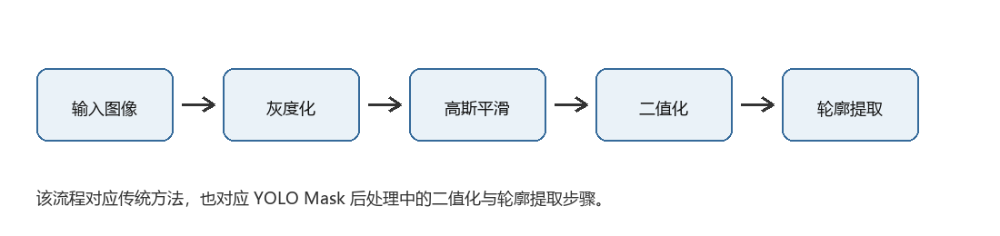

图 2-1 图像预处理流程图。

图 2.1中的每一步都能在系统中找到对应位置。灰度化对应后端接收图像后的统一输入处理；高斯平滑主要出现在霍夫圆、Canny+霍夫以及Mask后处理流程中；二值化和轮廓提取则集中体现在方法二和方法四中。本文没有把这些基础步骤单独作为创新点，而是把它们作为算法比较的共同基础。这样写的原因是，圆心检测结果并不只由最后一步拟合决定，前面的图像表达方式也会影响候选区域是否正确。如果二值图已经把目标区域切碎，后续最小外接圆即使数学上能得到圆，也可能不是钻孔区域对应的圆。
灰度化是本项目后端处理图像的第一步。前端上传的是彩色图像，后端通过OpenCV解码后得到BGR三通道图像，再转换为灰度图。灰度图保留亮度变化，降低了计算维度。国内关于实例分割的综述指出，实例分割不仅需要像素级划分目标区域，还需要区分不同目标实例，并会受到遮挡和数据标注等因素影响[23]。对于霍夫圆、Canny、二值化和轮廓提取等传统方法来说，图像中的边缘主要由灰度变化决定，因此灰度化可以满足算法输入要求。方法四虽然最终需要三通道输入给YOLO模型，但代码中也先以灰度图作为统一输入，然后在推理前将灰度图转换为RGB图像，以适配模型接口。
高斯平滑用于降低图像中的局部噪声。代码中霍夫圆方法、轮廓最小外接圆方法、基于Canny的单尺度霍夫检测方法和基于YOLOv8分割Mask的圆心检测方法都使用了高斯滤波。高斯滤波通过邻域加权平均削弱高频噪声，使孤立噪点不容易被误判为边缘。与平滑滤波相关的研究表明，滤波可以改善噪声图像的局部稳定性，但过强平滑也会削弱有效边缘[24]。因此滤波核大小不能盲目增大。本项目使用较常见的5×5高斯核，属于保守配置。
二值化是将灰度图转换为黑白图的过程。方法二中，如果用户没有手动设置阈值，系统使用Otsu大津法自动选择阈值；如果传入固定阈值，则按该阈值直接分割。二值化后的图像用于轮廓提取。这个方法计算速度快，但对光照和背景非常敏感：一旦图像中背景区域亮度接近目标区域，二值化会产生很多无关连通块；如果孔口区域和背景对比不足，目标轮廓也可能被切碎。相关改进Canny研究针对传统Canny阈值依赖人工设定的问题，引入Otsu方法提高阈值选择的自适应性[25]。边缘增强研究也进一步尝试通过多尺度细节增强和自适应阈值改善边缘检测效果[26]。而自适应阈值边缘检测研究也提出固定阈值在图像质量变化时容易会出现不稳定现象[27]。
图 2.2展示了同一张测试图像在灰度化、高斯平滑和Otsu二值化后的效果。可以看到，灰度化后图像仍保留了孔口与背景之间的亮度差异；高斯平滑使局部噪声变弱，但边缘也会变得略微柔和；二值化后目标和背景被分成黑白区域，轮廓提取可以在此基础上进行。这个例子也说明，二值化结果并不一定等于真实目标区域，若背景亮度接近目标区域，就可能产生误分割。
同时能解释传统方法在本文测试集中出现误差的原因。灰度化和平滑处理后，孔口区域仍然能够被观察到，但二值化后图像中可能同时保留目标和部分背景块。对于方法二来说，系统只能根据面积、圆度和位置等规则筛选轮廓，如果背景块的面积更大或形态更接近筛选条件，就可能被误选为目标。方法四的区别在于，它并不是直接对灰度图阈值分割，而是由YOLOv8输出目标Mask，再进入二值化和轮廓步骤。也就是说，方法四的二值化对象已经是模型判断后的目标区域，受原图局部亮度的直接影响相对小一些。

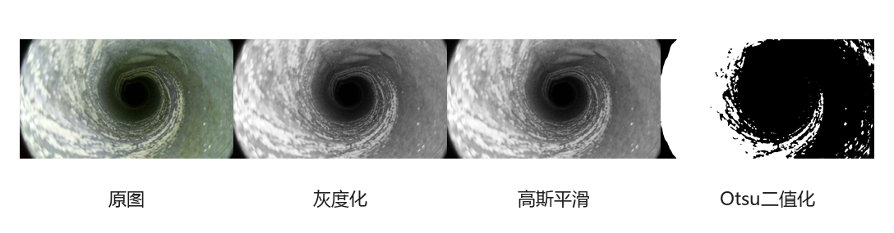

图 2-2 灰度化、平滑和二值化效果对比图。

轮廓提取通过cv2.findContours从二值图中找出连通区域边界。方法二在提取所有轮廓后，会根据面积、圆度和目标选择策略筛选候选轮廓，再用最小外接圆拟合圆心和半径。轴承内外径检测研究说明，边缘位置提取可以服务于圆形零件的尺寸测量[28]。玻璃量器液面调定研究表明，机器视觉测量中的成像条件、检测程序和参数设置都会成为不确定度来源[29]。方法四中，YOLO输出的Mask也会先被转换为二值图，再提取轮廓。二者不同之处在于：方法二的二值图来自灰度阈值，容易受光照和背景影响；方法四的二值图来自模型分割结果，已经包含模型学习到的目标语义。
圆度是轮廓筛选中常用的几何指标。代码中圆度计算公式见	式（2.1）：
	C=4πAP2	（2.1）
其中，A表示轮廓面积，P表示轮廓周长。理想圆的圆度接近1，细长裂缝或不规则背景块的圆度会明显降低。同时，系统并不把圆度作为唯一判断依据，因为钻孔图像中的目标可能存在遮挡或边缘破损，过于严格的圆度阈值反而会误删真实目标。因此系统还提供面积最大、最佳圆度和距图像中心最近等选择策略。
图 2.3给出了轮廓提取与最小外接圆的示意。绿色线条表示从二值区域中提取到的主要轮廓，红色圆表示该轮廓的最小外接圆，蓝色点为由外接圆得到的估计圆心。该图对应本文方法二的核心处理过程，也对应方法四中Mask轮廓转几何参数的后处理思路。不同之处在于，方法二的轮廓来自灰度阈值，方法四的轮廓来自神经网络输出的Mask。
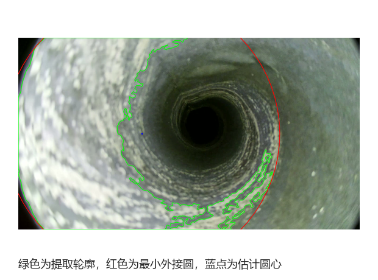

图 2-3 轮廓提取与最小外接圆示意图。

## 2.相关算法回顾

霍夫圆变换是一种经典圆检测方法。圆可以由圆心坐标(a,b)和半径r表示，图像中的边缘点可以在参数空间中为可能的圆心和半径投票。当多个边缘点支持同一组参数时，该参数就可能对应图像中的圆。国内关于快速霍夫变换的研究说明，参数空间搜索效率是Hough类方法的重要问题[30]。改进广义Hough变换获取圆心坐标的研究也说明，圆心定位精度与投票和拟合策略有关[31]。项目中的方法一调用 cv2.HoughCircles，先对灰度图进行高斯平滑，再由OpenCV内部完成边缘处理和圆检测。该方法输出直接，适合边界较完整、噪声较少的图像；但它对dp、minDist、param1、param2、minRadius和maxRadiu等参数比较敏感。如果半径范围设置不合适，或边缘残缺导致投票分散，检测结果会明显偏移。
图 2.4是根据霍夫圆变换投票思想绘制的示意图。图像空间中的每个边缘点，都会对应参数空间中的一组可能圆心；当多个边缘点对同一圆心和半径形成较多支持时，该位置就会成为候选圆。这个机制解释了霍夫圆方法的优点，也解释了它在破损边缘图像上的问题：有效边缘点不足时，投票会变得分散；背景伪边缘较多时，错误区域也可能得到较高票数。

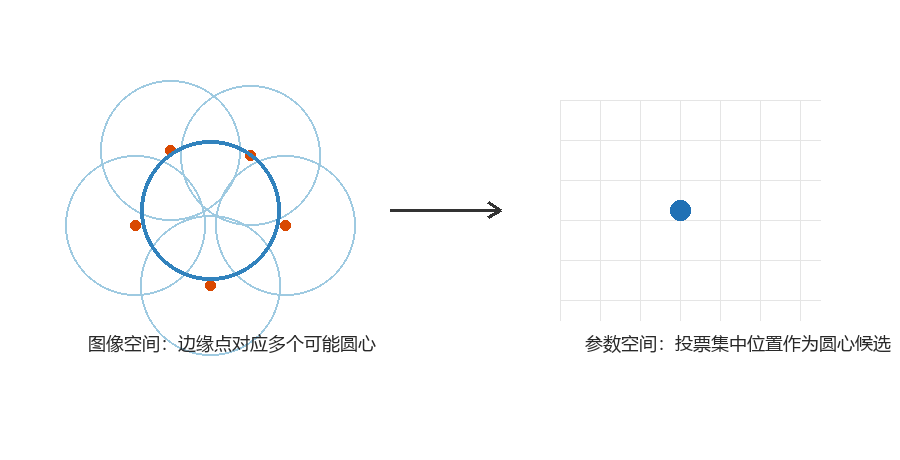

图 2-4 霍夫圆变换投票原理示意图。

霍夫圆变换的可解释性比较强，圆心和半径来自参数空间投票，这也是它适合作为传统基线的原因。但是这种方法的前提也比较明确：图像中需要有足够多的、属于同一个圆周的有效边缘点。如果边缘只剩下局部弧段，或者背景纹理中存在大量类似弧线的结构，参数空间的投票就可能分散到多个位置。本文批量评测中方法一虽然返回了圆，但平均中心误差达到 263.02 px，说明它在当前默认参数和测试图像下经常能“找到圆”，但不一定找到正确的钻孔圆。这个结果也提醒本文不能只看成功率，还要结合中心误差和区域 IoU。

轮廓最小外接圆方法不直接在参数空间投票，而是先通过二值化和轮廓提取找到候选目标区域，再用cv2.minEnclosingCircle计算能够包住该轮廓的最小圆。机器视觉在工业检测中的应用研究表明，该类技术具有快速、准确、非接触等特点[32]。即它的优点是速度快、逻辑直观，对部分不规则区域也能给出几何包络；不足在于高度依赖二值化质量。当前批量评测中，该方法虽然成功率显示为100%，但平均中心误差很大，说明“能拟合出一个圆”并不等于“拟合到了正确目标”。
基于Canny的单尺度霍夫圆检测方法可以看作对标准霍夫圆的一个可控变体。先由外部Canny算子提取边缘，再可选使用形态学闭运算连接断裂边缘，随后把处理后的边缘图输入霍夫圆检测。这样做的好处是Canny阈值和霍夫投票阈值可以分开调节，边缘层的生成过程更可控。基于Canny的边缘检测改进研究尝试通过滤波和变换改进传统Canny的边缘细节保留[33]。另一类改进Canny方法则关注阈值设置和边缘定位稳定性[34]。本项目中将HoughCircles的param1设置为1，使其更信任外部生成的边缘图。不过在当前测试集上，该方法成功率只有6.25%，说明当边缘图本身无法形成稳定几何结构时，后续霍夫拟合仍然很难补救。
图 2.5给出了Canny边缘检测的基本流程。本文方法三并不是直接调用霍夫圆检测，而是先显式生成Canny边缘图，再将边缘图送入HoughCircles。这样做的好处是Canny的高低阈值可以单独调节，便于观察边缘层对最终圆检测结果的影响。实际评测中，方法三成功率较低，也说明边缘图质量不足时，后续投票阶段难以稳定恢复圆形结构。

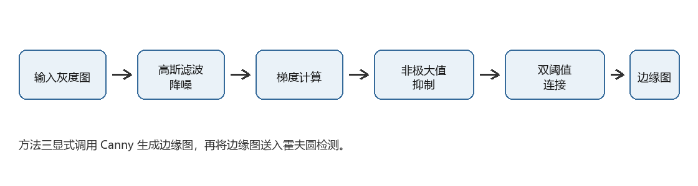

图 2-5 Canny 边缘检测流程图。

实例分割与上述传统方法的差别在于，它输出的是对象区域，而不是只输出边缘或检测框。检测框只能提供目标的大致矩形范围，其几何中心未必等于圆形目标中心；分割Mask则保留了目标区域的像素级形状。对于钻孔圆心检测，Mask的优势在于可以把遮挡和边缘破损后的剩余区域整合起来，再通过区域质心或外接圆估计圆心。本文方法四正是基于这一点设计。
图 2.6展示了检测框和实例分割Mask的区别。左侧检测框只能给出目标的大致矩形范围，矩形中心和真实孔口圆心并不必然一致；右侧Mask则保留了目标区域的形状边界，后续可以进一步计算图像矩质心或最小外接圆。本文方法四没有直接使用矩形框中心，而是基于Mask计算圆心，原因就在于Mask对目标区域形状的表达更充分。

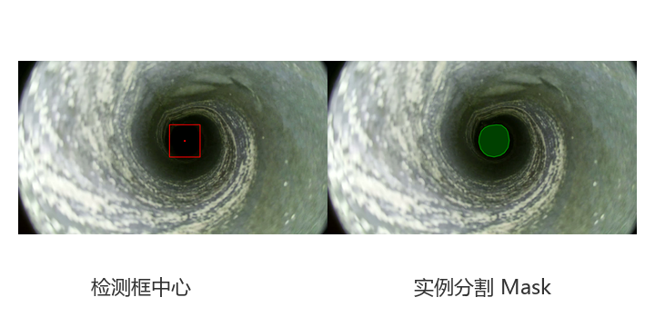

图 2-6 检测框与实例分割 Mask 对比图。

在钻孔圆心检测任务中，矩形框中心存在一个实际问题：矩形框描述的是外接范围，而不是目标区域本身。如果孔口边缘局部破损，或者目标在图像中存在轻微偏斜，矩形框中心可能会受到空白区域和外接边界影响。Mask的信息更细，它保留了目标区域内部的像素分布，后续用图像矩计算质心时，参与计算的是区域整体，而不是矩形框的四条边。因此，本文把YOLOv8分割模型作为核心，不是为了单纯换一个深度学习模型，而是为了获得更适合圆心估计的区域表达。
YOLOv8是Ultralytics提供的一类目标检测和分割模型。本文使用的是YOLOv8n-seg预训练模型作为基础，在自建钻孔图像数据集上进行实例分割训练。推理阶段，模型接收RGB图像，输出目标类别、置信度和Mask。系统设置置信度阈值conf_thresh，默认值为0.25。阈值过高可能导致漏检，阈值过低则可能带来误检。本文不把置信度阈值写成固定最优值，而是将其作为前端可调参数，便于不同图像下实验。
目标筛选策略用于解决一张图中可能存在多个候选目标的问题。方法二和方法四均支持三种策略：面积最大、圆度最佳、距图像中心最近。面积最大适合目标主体明显的场景；圆度最佳适合背景干扰较多但目标形状较规则的场景；距中心最近适合拍摄时孔口通常位于画面中部的情况。当前默认策略为面积最大，这是因为管道模拟数据中的钻孔区域通常是主要目标。
圆心估计策略是方法四的关键后处理。默认图像矩法利用轮廓的空间矩计算质心，见	式（2.2）：
	cx=m10m00，cy=m01m00	（2.2）

其中，m00可理解为区域面积相关量，m10、m01表示一阶矩。图像矩法更关注区域整体质量分布，对局部边缘锯齿不那么敏感。备用的最小外接圆法则通过轮廓外接圆得到圆心和半径，对边缘残缺时的包络估计更直接。代码中通过center_method 参数选择两种方式。
评测指标方面，本文使用的指标包括成功率、平均耗时、中心误差、半径误差、边缘覆盖率、霍夫置信度、内部Mask IoU和预测圆与标注掩码IoU。中心误差用于衡量预测圆心与标注圆心的欧氏距离；半径误差衡量半径偏差；边缘覆盖率统计预测圆周与原始边缘图的重合比例；Mask IoU则评价预测圆或预测区域与掩码区域的交并比。由于不同方法输出机制不同，本文更重视与方法机制匹配的指标，而不是用某一个指标概括所有结果。
对于中心误差、半径误差和IoU，图 2.7作了含义示意。中心误差直接对应本文的核心任务，反映预测圆心与标注圆心之间的距离；半径误差用于补充说明圆大小是否接近标注结果；IoU则把预测圆区域与标注区域进行比较，观察二者重合程度。置信度和边缘覆盖率更偏向单次检测结果解释，而中心误差、半径误差和IoU更适合批量评测中的方法对比。
这里需要特别说明前端单图指标和批量评测指标之间的关系。前端显示的边缘覆盖率、霍夫置信度和Mask IoU，主要用于解释某一次检测结果的内部支持程度；批量评测中的中心误差和半径误差，则需要依赖人工标注或由标注掩码换算得到的参考值。两类指标并不矛盾。前者更适合调试算法，后者更适合比较算法最终效果。本文题目强调圆心检测，因此第5章把中心误差作为重点指标，同时保留覆盖率、置信度和Mask IoU来解释不同方法的输出机制。

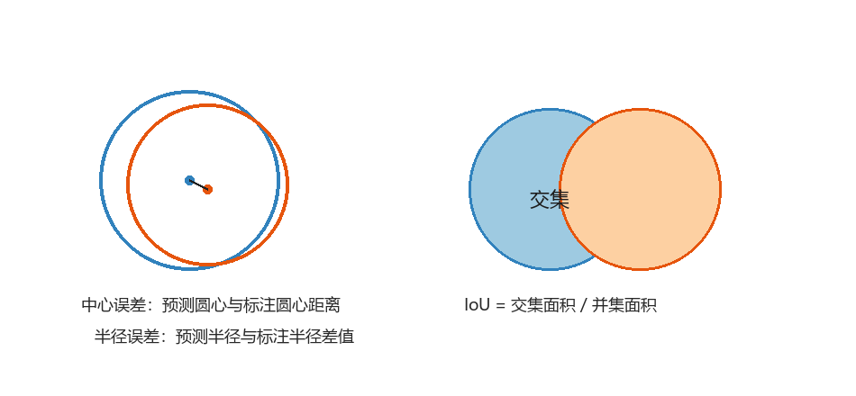

图 2-7 圆心误差、半径误差和 IoU 指标示意图。


## 3.开发环境与工具

本文项目主要使用Python和OpenCV完成后端图像处理与传统算法实现。OpenCV作为开源计算机视觉库，为图像读写、滤波、边缘检测、轮廓分析和几何绘制提供了稳定接口[35]。OpenCV在本项目中负责图像解码、灰度化、高斯滤波、Canny边缘检测、霍夫圆检测、二值化、轮廓提取、图像矩计算、最小外接圆拟合和结果绘制。NumPy用于图像矩阵和指标计算。
深度学习部分使用Ultralytics YOLO接口进行模型训练和推理。训练脚本 train_advanced.py使用YOLOv8n-seg 预训练权重，训练配置包括epochs=200、imgsz=640、batch=8、optimizer=AdamW、lr0=0.001、lrf=0.01、patience=50、mosaic=1.0、mixup=0.1、HSV 颜色增强、随机旋转、上下/左右翻转和AMP自动混合精度训练。训练结果保存于 runs/segment/Borehole_Training/YOLOv8n_Seg_Run1。
系统后端使用FastAPI搭建接口，核心接口为/api/detect。前端上传图像、算法编号、是否开启对比模式和参数JSON，后端解析后调用对应算法函数。由于前端可能直接通过浏览器访问，而后端运行在本地8000端口，项目中加入了CORS中间件以允许跨源请求。
前端界面由HTML、JavaScript和Tailwind CSS类样式实现，主要功能包括图片上传、参数面板动态生成、检测按钮、单方法结果展示、四方法对比展示和PNG图像导出。前端不是单纯展示页面，它承担了实验交互入口的作用，使用户可以直观看到参数改变对检测结果的影响。
实验硬件环境为：12th Gen Intel(R) Core(TM) i7-12700H处理器，NVIDIA GeForce RTX 3060 Laptop GPU，显存6GB，Windows 11专业版，内存16.0 GB（15.7 GB 可用）。

# 第 3 章 算法设计（5000 字｜核心章）

## 1.整体流程设计

本文算法系统采用“统一输入、分支检测、统一输出、指标评估”的总体流程。用户在前端上传钻孔图像后，浏览器将图像文件、所选算法、对比模式状态和参数字典打包为FormData，通过POST请求发送给FastAPI后端。后端接收二进制图像流，用OpenCV解码为BGR图像，再转换为灰度图。灰度图作为四种算法的统一输入，其中方法四在推理前再转换为RGB图像。
后端通过方法字典完成算法路由。若用户未开启对比模式，系统只运行当前选定方法；若开启对比模式，系统依次运行方法一至方法四。每个算法函数都返回统一结构，包括检测是否成功、圆心、半径、调试图、诊断信息和耗时。后端再根据方法类型计算对应指标，将结果图和边缘图编码成Base64字符串返回给前端。整体流程概括如图 3.1所示：

整体流程可概括如下：

```text
输入图像
  -> OpenCV 解码与灰度化
  -> 根据 compare_mode 选择单方法或四方法
  -> 方法一：高斯平滑 + 霍夫圆
  -> 方法二：二值化 + 轮廓筛选 + 最小外接圆
  -> 方法三：Canny + 闭运算 + 霍夫圆
  -> 方法四：YOLOv8 分割 + Mask 后处理 + 圆心估计
  -> 指标计算与可视化绘制
  -> 前端展示与导出
```

图 3-1 为算法总流程图。


图注建议：该图可以画成左侧输入图像，中间分成四个算法分支，右侧统一输出圆心、半径、指标和结果图。方法四分支需要突出“YOLOv8 Mask -> 轮廓 -> 圆心估计”。

## 2.核心步骤详细设计

方法一为霍夫圆变换的检测流程，如图 3.2。该方法输入灰度图后，先执行5×5高斯平滑，降低局部噪声对边缘检测的影响。随后调用OpenCV的HoughCircles，根据参数dp、minDist、param1、param2、minRadius、maxRadius搜索候选圆。检测成功时，系统取第一个候选圆作为结果。OpenCV返回的候选圆通常按内部评分排序，因此该方法相当于选择得票较高的圆。方法一的优点是输出直接、解释清楚；缺点是对半径范围和投票阈值很敏感，面对大图像时耗时也较高。批量评测中方法一平均耗时超过31秒，说明在当前默认参数和图像尺寸下效率不理想。

图 3-2 为方法一处理流程图。


方法二为轮廓最小外接圆检测流程，如图 3.3。系统先根据参数选择固定阈值或 Otsu自动阈值，将灰度图转换为二值图。接着使用findContours提取所有轮廓，并计算每个轮廓的面积、周长、圆度和到图像中心的距离。候选轮廓需要满足最小面积、最大面积比例和最小圆度阈值。筛选后，根据用户选择的策略确定最终目标：面积最大、圆度最佳或距离中心最近。最后使用minEnclosingCircle得到圆心和半径。该方法速度很快，批量评测平均耗时约8.18 ms，但容易把背景连通块当作目标，因此在复杂背景下中心误差可能很大。

图 3-3 为方法二处理流程图。


方法三为基于Canny边缘单尺度霍夫圆检测流程，如图 3.4。它先对灰度图高斯平滑，再使用用户设定的canny_low和canny_high提取边缘。若开启形态学闭运算，系统用5×5椭圆结构元素连接断裂边缘。处理后的边缘图被保存为调试图，并输入HoughCircles做圆检测。与方法一不同，方法三把边缘提取放在外部显式完成，使Canny阈值可由用户控制。代码中Hough的param1固定为1，意图是让Hough阶段尽量信任外部边缘图。该方法理论上能提高对弱边缘和断裂边缘的控制能力，但如果输入边缘图噪声多、目标弧线不连续，霍夫投票仍然无法形成稳定圆。

图 3-4 为方法三处理流程图。


方法四为本文核心的YOLOv8实例分割圆心检测流程，如图 3.5。输入灰度图先转换为RGB图像，再送入YOLOv8n-seg模型推理。模型输出一个或多个目标Mask。每个原始Mask会被缩放回原图尺寸，转换为uint8图像，再进行二值化和高斯平滑，以减少Mask边缘锯齿对轮廓提取的影响。Otsu阈值法是经典的自动阈值选择方法，本文代码在方法二中使用了这一思想，方法四的Mask后处理也包含二值化操作[36]。系统提取每个Mask的外部轮廓，计算面积、圆度、最小外接圆、图像矩质心和到图像中心距离，并把这些信息保存为候选目标。
候选目标筛选与方法二类似，支持面积最大、最佳圆度和靠近中心三种策略。当前默认策略为面积最大。OpenCV中常用的轮廓提取与边界跟踪思想可追溯到Suzuki和Abe的二值图像边界分析方法[37]。确定目标后，系统根据center_method参数决定圆心估计方式：若为moments，使用图像矩计算质心，并用A/π将掩码面积折算为等效半径；若为min_enclosing，直接使用最小外接圆的圆心和半径。最终输出圆心、半径、成功状态和Mask调试图。
方法四与直接使用检测框中心不同。检测框只描述目标外接矩形，矩形中心容易受局部遮挡或目标外形偏斜影响；Mask描述的是像素级目标区域，通过图像矩计算的质心与区域整体分布相关，更适合本文“圆心鲁棒检测”的目标。即使目标边缘局部破损，只要模型能够分割出主要区域，几何后处理仍有机会给出较稳定的圆心。


## 3.关键策略说明

第一项关键策略是用区域级Mask替代单纯边缘依赖。传统霍夫方法需要足够多的有效边缘点形成参数空间投票；Canny+霍夫方法虽然显式修补了边缘，但本质上仍依赖边缘图。如果钻孔边界被遮挡，或者局部边缘与背景纹理混在一起，边缘投票会变得不稳定。方法四先由神经网络识别目标区域，再从区域推算圆心，减少了对完整边缘的依赖。
第二项关键策略是目标筛选。实际图像中可能存在多个亮暗区域或多个模型候选 Mask，如果直接取第一个结果，可能无法适应不同图像。系统提供面积最大、最佳圆度和靠近中心三种策略。面积最大适合目标主体清晰的情况；最佳圆度适合背景块较多但目标形态相对圆的情况；靠近中心适合相机或探头视角较固定的情况。这些策略没有绝对优劣，论文中采用默认策略作为当前实验设置，同时保留其他策略用于后续调参。
第三项关键策略是双中心估计。图像矩是形状描述中的经典工具[38]，图像距法可以把Mask看作二维区域，通过区域分布计算质心，对局部边缘毛刺和小缺口相对不敏感。而最小外接圆法更强调几何包络，适合需要直接输出覆盖目标的圆时使用。本文默认选择图像矩法，是因为当前任务更关注圆心位置而不是完整包络面积；但保留最小外接圆法可以在部分边缘残缺或掩码外形偏不规则的情况下进行对照。
第四项关键策略是分算法指标。系统没有把所有方法都强行套入同一个置信度。霍夫类方法可以计算基于边缘图的置信度；面提取类方法更适合计算Mask IoU。对于批量评测，中心误差和半径误差提供了更直接的几何评价，预测圆与标注掩码IoU则提供区域重合评价。这样可以更清楚地区分“检测成功但目标错了”和“检测失败”两种情况。
第五项关键策略是异常结果可解释输出。每个算法函数都返回诊断信息，例如“未找到能构成完整的圆”“未找到满足面积限定和基本形态的对象”“YOLO未能在当前置信度下找到目标”。这些信息在论文系统实现章节中可以作为异常处理说明，也方便后续排查失败样本。

## 4.伪代码 / 公式

以下是系统关键部分的伪代码和公式：
四算法统一调度伪代码
输入：图像 file，方法 method，对比模式 compare_mode，参数 params
输出：各方法检测结果 result
1image = OpenCV解码(file)
2gray = BGR转灰度(image)
3methods = {
4    method1: 霍夫圆检测,
5    method2: 轮廓最小外接圆,
6    method3: Canny+霍夫,
7    method4: YOLOv8分割圆心检测
8}
9
10if compare_mode:
11    methods_to_run = [method1, method2, method3, method4]
12else:
13    methods_to_run = [method]
14
15for each m in methods_to_run:
16    res = methods[m](gray, params[m])
17    if res.success:
18        绘制圆心和圆
19        计算与方法匹配的评价指标
20    编码结果图和调试图
21    results[m] = res
22
23return results

方法四核心伪代码
输入：灰度图 gray，参数 conf_thresh, selection_mode, center_method
输出：圆心 center，半径 radius
1rgb = gray转RGB
2pred = YOLOv8分割模型(rgb, conf_thresh)
3if pred.masks为空:
4    return 检测失败
5
6候选列表 = []
7for mask in pred.masks:
8    mask = 缩放到原图尺寸
9    mask = 二值化 + 平滑 + 再二值化
10    contour = 提取最大外轮廓
11    area = 轮廓面积
12    circularity = 4*pi*area/perimeter^2
13    enclosing_circle = 最小外接圆(contour)
14    moments_center = 图像矩质心(contour)
15    distance = 候选中心到图像中心距离
16    加入候选列表
17
18best = 根据 selection_mode 选择候选
19if center_method == "min_enclosing":
20    center, radius = best.外接圆圆心与半径
21else:
22    center = best.图像矩质心
23    radius = sqrt(best.area/pi)
24
25return center, radius
中心误差公式为：
	Ec=(xp−xg)2+(yp−yg)2	（3.1）
其中，(xp−xg)2 为预测圆心，(yp−yg)2 为标注圆心。
半径误差公式为：
	Er=|rp−rg|	（3.2）
边缘覆盖率可理解为：在预测圆周上采样或绘制理想圆，统计这些圆周像素被原图边缘图覆盖的比例。项目代码通过对边缘图进行一定容差膨胀，再计算理想圆周像素命中比例。
Mask IoU公式为：
	IoU=A∩BA∪B 	（3.3）
其中，A表示预测圆区域或预测Mask，B表示标注Mask或用于比较的区域。IoU越接近1，表示两个区域重合越充分。

# 第 4 章 软件系统设计与实现（4000 字）

## 1.系统总体框架设计

本文软件系统的定位是圆心检测实验平台，不是通用业务管理系统。系统需要解决的问题比较明确：用户把钻孔图像上传到前端，选择检测方法和参数，后端完成图像处理、算法调用和指标计算，再把可视化结果返回给前端展示，并支持导出PNG。围绕这个目标，系统采用前后端分离的结构，前端负责交互和结果展示，后端负责图像解码、算法调度、模型推理、指标计算和结果编码。
系统总体框架与数据流图如图 4.1所示。数据流从前端开始，用户上传图像并设置参数后，浏览器将图片文件、方法编号、对比模式状态和参数JSON发送到FastAPI后端。后端接收到请求后，先使用OpenCV将二进制图片解码为图像矩阵，再转换为灰度图。对于方法一、方法二和方法三，灰度图可以直接作为后续输入；对于方法四，系统会在推理前把灰度图转换为RGB图像，以适配YOLOv8分割模型。算法执行完成后，后端会把圆心、半径、成功状态、耗时、诊断信息和指标结果组织成统一结构，同时把结果图编码为Base64字符串返回给前端。

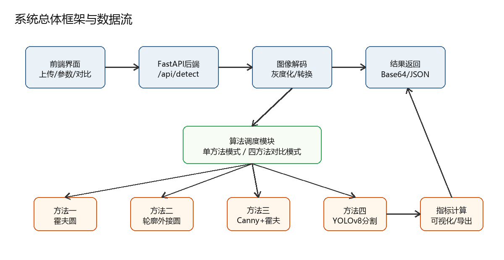

图 4-1 系统总体框架与数据流图。

其中一条是图像数据线，从前端上传的原始图片开始，经过后端解码、灰度化、算法检测、结果绘制，最后以Base64图像形式返回前端；另一条是参数与指标线，从前端参数面板生成JSON，后端根据参数调用对应算法，再把圆心、半径、耗时和评价指标返回。两条线在结果输出部分汇合，这也是系统设计中最关键的位置。若没有统一的参数解析和结果结构，四种方法就很难在同一个界面中并排比较。
这种框架还体现了本文软件设计的边界。系统没有引入数据库，也没有设计用户权限和历史任务管理，因为当前研究目标是完成圆心检测算法验证，而不是建设长期在线平台。把系统范围收束在“单图检测、四方法对比、结果导出”上，可以减少与论文主题无关的实现负担。
从功能联系上看，系统可以分为五个主要部分：前端交互模块、后端接口模块、算法检测模块、评价指标模块和结果导出模块。前端交互模块主要负责接收用户操作，它不直接进行复杂图像处理；后端接口模块负责把前端请求转换成算法可以使用的数据；算法检测模块是系统核心，四种检测方法都封装在detectors.py中；评价指标模块位于eval_metrics.py，用来计算边缘覆盖率、霍夫置信度和Mask IoU等指标；结果导出模块主要由前端完成，用于把检测结果整理成表格或图片。
这种结构的优点是职责比较清楚。前端不需要知道每种算法的内部实现，只需要根据统一返回结构渲染结果；后端主流程也不需要为每个算法写大量重复逻辑，而是通过方法字典完成调度。后续如果增加新的检测算法，只要保证新函数返回相同结构，就可以接入现有展示和导出流程。这一点对实验系统比较重要，因为对比方法可以会随着后续数据和需求继续扩展。

## 2.功能模块设计


（1）前端交互模块
前端交互模块的流程如图 4.2所示。该模块位于index.html，主要负责接收用户操作，包括图片上传、算法选择、对比模式切换、参数填写、开始检测和结果导出。用户选择或拖拽图片后，前端会保存当前文件对象；用户切换算法时，前端根据算法编号显示对应参数面板；用户点击检测按钮后，前端把图像文件、method、compare_mode和参数JSON一并封装到FormData中，并发送到后端/api/detect接口。

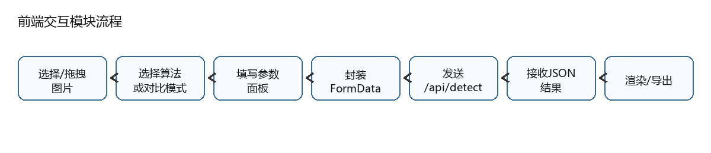

图 4-2 前端交互模块流程图。

前端交互模块的设计重点是让实验操作集中在一个界面内完成。对本文来说，前端不是单纯展示界面，而是承担了实验入口的作用。参数面板让用户可以调整霍夫圆参数、二值化阈值、Canny阈值、YOLO置信度和圆心估计方式；对比模式让四种方法可以在同一张图像上同时运行；结果区则把检测图、圆心、半径、耗时和指标集中展示。这样设计后，实验者不需要反复修改代码参数，也可以观察不同方法和不同参数对结果的影响。
前端交互模块还负责基础结果渲染。后端返回JSON后，前端根据success字段判断检测是否成功，并将结果图、调试图和指标信息显示到页面。若开启对比模式，前端会为四种方法分别生成结果卡片，使用户能够直接比较传统方法和YOLOv8分割方法的差异。该模块不进行复杂图像处理，图像解码、算法计算和指标计算都交给后端完成，这样可以避免前端逻辑过重。


（2）后端接口模块
后端接口模块的流程如图 4.3所示。该模块位于app.py，核心接口为/api/detect。前端发送请求后，后端先读取UploadFile字节流，再使用OpenCV解码为BGR图像，并统一转换为灰度图。由于四种算法内部机制不同，统一输入格式很关键：方法一、方法二和方法三直接使用灰度图；方法四需要RGB图像，因此只在进入YOLOv8推理前做格式转换。

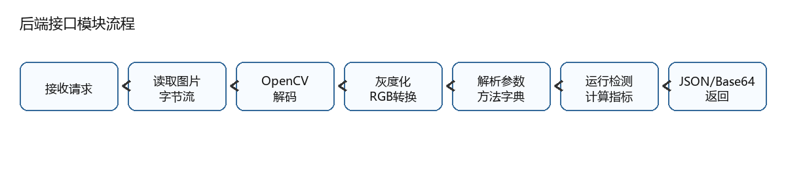

图 4-3 后端接口模块流程图。

后端接口模块同时承担参数解析和算法调度入口的作用。请求中包含method和compare_mode两个关键信息，其中method表示当前选定算法，compare_mode表示是否开启对比模式。后端解析参数后，会构造方法字典，把method1、method2、method3、method4分别映射到对应的检测函数和参数集合。这样做可以避免在接口中堆叠大量if-else分支，也方便后续扩展新的检测方法。
如果compare_mode为false，系统只运行当前method对应的检测函数；如果compare_mode为true，系统会依次运行四种方法，并把结果合并返回。这个设计使单方法检测和多方法对比共用同一套后端流程，减少了重复代码。实际代码中的核心逻辑是methods_dict和methods_to_run：前者保存方法编号与函数之间的对应关系，后者根据对比模式决定本次要运行的方法列表。
调度模块还承担了参数隔离作用。不同算法需要的参数并不相同，例如霍夫圆变换需要dp、minDist、param1、param2和半径范围；轮廓最小外接圆需要二值化阈值、最小面积、圆度阈值和选择策略；YOLOv8分割方法则需要置信度阈值、目标筛选策略和圆心估计方式。系统把不同方法的参数分别放在对应字段中，后端调用时只取当前方法所需参数，避免了参数之间互相干扰。

（3）算法检测模块
算法检测模块位于detectors.py，是本文软件系统中与算法实现关系最紧密的部分。该模块封装了四个检测函数：detect_hough、detect_min_enclosing、detect_canny_hough和detect_yolo_segmentation。四个函数内部流程不同，但输出结构保持一致，均包含center、radius、success、debug和diagnostics等字段。统一输出结构是系统能进行对比展示的前提。
方法一detect_hough调用OpenCV的HoughCircles完成圆检测。该方法先对灰度图进行高斯平滑，再根据半径范围和投票阈值搜索候选圆。方法二detect_min_enclosing先进行二值化和轮廓提取，再按面积、圆度和选择策略筛选目标，最后用最小外接圆得到圆心和半径。方法三detect_canny_hough先显式生成Canny边缘图，并可选使用形态学闭运算连接断裂边缘，再将边缘图送入霍夫圆检测。方法四detect_yolo_segmentation则先加载YOLOv8n-seg模型，获得目标Mask后进行后处理，最后通过图像矩或最小外接圆估计圆心。

（4）评价指标模块
评价指标模块的流程如图 4.4所示。系统不会把所有算法强行套用同一个指标，而是根据算法类型计算更合适的指标。方法一和方法三属于边缘/霍夫类方法，后端会计算霍夫置信度和边缘覆盖率；方法二和方法四属于区域/掩码类方法，后端更适合计算Mask IoU。批量评测时，系统进一步结合标注文件计算中心误差、半径误差和预测圆与标注掩码IoU。

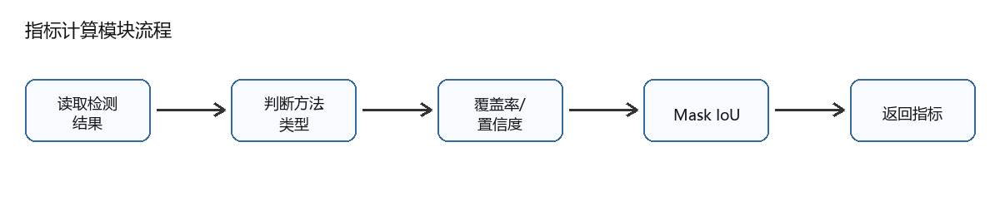

图 4-4 指标计算模块流程图。

评价指标模块还承担了结果解释功能。单独给出圆心和半径，用户只能看到一个最终数字，无法判断这个结果是由稳定边缘支持得到的，还是由错误连通块拟合出来的。加入边缘覆盖率、置信度和Mask IoU后，系统能提供更多诊断信息。例如，霍夫圆结果若中心误差较大，同时边缘覆盖率也很低，就说明预测圆周和图像边缘关系较弱；方法四若内部Mask IoU较高，则说明预测圆区域与模型分割区域比较一致。这些信息对失败样本分析有帮助。
边缘覆盖率用于描述预测圆周与原图边缘之间的重合程度。项目代码会在边缘图上设置一定容差，再统计预测圆周像素被边缘覆盖的比例。霍夫置信度则用于描述候选圆附近边缘支持情况。Mask IoU用于描述预测圆区域与掩码区域的交并比，适合方法二和方法四这类区域型方法。中心误差和半径误差不属于单图前端解释指标，而是批量评测时与人工标注进行对比得到的几何误差，它们能更直接反映圆心和半径是否接近标注结果。
这种分算法评价方式有必要保留。若只用边缘覆盖率评价方法四，可能会低估实例分割的效果，因为方法四输出的是语义区域，不一定与原始边缘图完全重合；若只用Mask IoU评价霍夫类方法，又会忽略圆周边缘支持情况。因此，本文采用边缘指标和区域指标并行的方式，再用中心误差、半径误差作为最终几何对比指标。


（5）结果展示与导出模块
结果展示与导出模块的流程如图 4.5所示。后端把检测圆、圆心点和调试信息绘制到结果图中，再将图像编码为Base64字符串。前端接收到JSON后，根据success字段判断是否显示有效结果，并将结果图、圆心坐标、半径、耗时和指标展示在页面中。如果开启对比模式，前端会生成四个结果卡片，分别展示四种方法的检测结果。

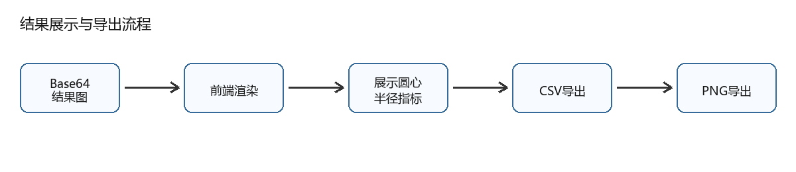

图 4-5 结果展示与导出模块流程图。

PNG导出用于保存可视化结果，前端通过canvas将图像、标题和指标绘制到同一张图中，再触发下载。这样设计的好处是后端不需要长期保存临时图片，减少文件管理成本；同时用户可以直接把导出的图表用于论文结果整理。

## 3.界面设计

界面整体可以分为顶部区、左侧参数区、左侧操作区、右侧结果展示区和底部结果区，如图 4.6所示。顶部区负责展示系统标题和结果导出；左侧参数区负责图片上传和算法选择，并根据当前算法动态显示参数；左侧操作区负责完成对比模式切和开始检测；右侧结果展示区显示检测图和关键结果；当开启对比模式时，系统会以多卡片形式展示四种方法结果；底部结果区负责展示当前系统状态，并展示总体结果指标。
界面设计中需要避免一个问题：把论文软件写成一个只有按钮和图片的展示页。本文系统虽然界面不复杂，但它承担了实验组织功能。参数区让实验者能够调整阈值、半径范围、目标选择策略和圆心估计方式；结果区让实验者看到每种算法的输出差异；导出功能让实验结果可以进入论文表格和图像整理流程。因此，界面设计的核心不是视觉装饰，而是让算法验证过程可操作、可复现、可对比。
顶部区是用户认识系统的开始。用户可以看到系统名与简单图标，并且在右侧提供导出PNG按钮，在下方有检测结果的时候，可以供用户导出结果。

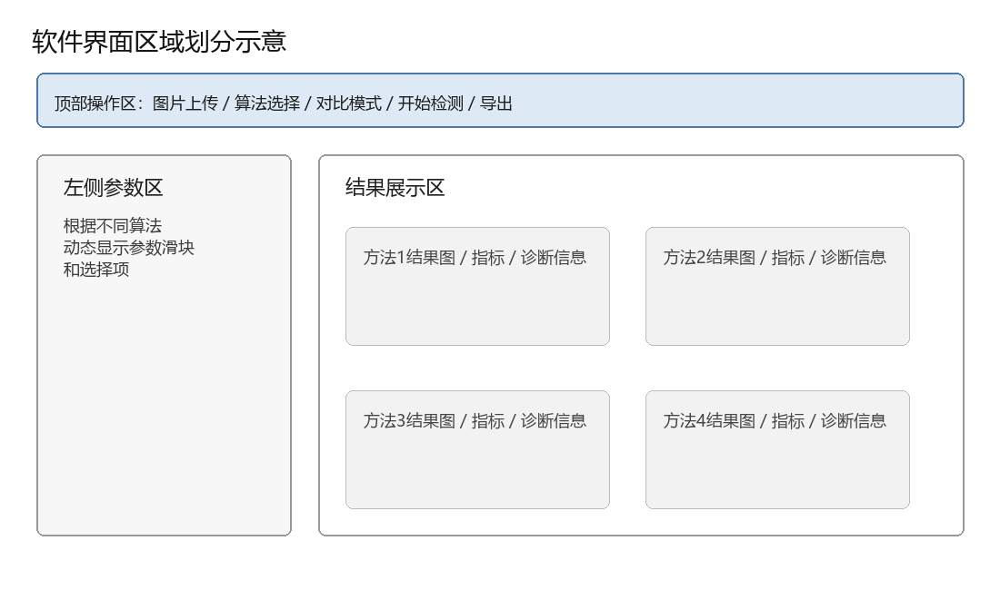

图 4-6 软件界面区域划分示意图。

左侧参数区用于传入图片并控制算法细节。用户先选择待检测图像，再选择检测方法。不同方法的参数面板不同，方法一主要控制霍夫圆参数，方法二控制二值化、面积、圆度和选择策略，方法三控制Canny阈值、闭运算和霍夫参数，方法四控制置信度阈值、目标筛选策略和圆心估计方法。参数区的意义不只是让用户修改数值，更重要的是让实验者能观察参数改变对检测结果的影响。例如，提高YOLO置信度阈值可能减少误检，但也可能造成漏检；提高圆度阈值可以排除不规则区域，但也可能误删边缘破损的真实目标。
左侧操作区用于修改模式和开始检测。如果当前只想查看一种算法的检测结果，可以保持单方法模式；如果要比较四种方法，则开启对比模式。对比模式下，后端会一次运行四种方法，前端把四组结果并排展示。这个设计与本文“多算法对比验证”的研究思路一致，也方便在同一张图上观察传统方法和方法四的差异。
结果展示区主要显示图像和指标。单方法模式下，系统展示当前方法的结果图、圆心、半径、耗时和指标；对比模式下，系统展示四种方法的检测结果。每个结果卡片都包含成功状态和诊断信息，如果检测失败，前端不会只显示空图，而会显示对应失败原因。这样处理能减少实验排查成本，也能在论文中说明系统具有基本异常反馈能力。
底部结果区负责显示当前系统的状态和总体结果指标。可以对外显示检测是否就绪，是否正在运行与是否检测完成，并且可以展示当前检测结果的整体指标，如当前最大的覆盖率。
界面设计没有加入用户登录、数据库管理或任务队列等功能，因为这些内容与本文圆心检测实验关系不大。当前系统重点是把算法验证流程做清楚：输入图像、调节参数、运行检测、显示结果、导出数据。当前的界面设计能够支撑实验展示，也能说明软件系统确实围绕课题目标实现，而不是只停留在模型训练脚本层面。

## 4.关键实现与异常处理

（1）后端算法调度代码体现了系统的统一框架：
methods_dict = {
        "method1": (detect_hough, parsed_params.get("method1", {})),
        "method2": (detect_min_enclosing, parsed_params.get("method2", {})),
        "method3": (detect_canny_hough, parsed_params.get("method3", {})),
        "method4": (detect_yolo_segmentation, parsed_params.get("method4", {}))
}
methods_to_run = list(methods_dict.keys()) if compare_mode else [method]
这段代码使单方法检测和四方法对比可以共用同一套流程。后续如果增加新的算法，只要新增检测函数并加入方法字典，主流程就不需要大幅修改。
（2）方法四中模型加载采用全局缓存：
_yolo_model = None

def get_yolo_model(model_path):
    global _yolo_model
    if _yolo_model is None:
        if YOLO is not None:
            _yolo_model = YOLO(model_path)
    return _yolo_model
YOLO模型加载耗时较高，如果每次请求都重新加载模型，会明显影响响应速度。全局缓存可以让模型在第一次使用时加载，后续请求复用同一个模型对象。
（3）方法四中的圆心估计代码体现了本文的“掩码驱动几何拟合”思路：
M = cv2.moments(largest_contour)
if M["m00"] != 0:
    cX_mom = int(M["m10"] / M["m00"])
    cY_mom = int(M["m01"] / M["m00"])
else:
    cX_mom, cY_mom = int(x_enc), int(y_enc)

center_method = params.get('center_method', 'moments')
if center_method == 'min_enclosing':
    cX, cY = int(x_enc), int(y_enc)
    radius_val = int(radius_enc)
else:
    cX, cY = cX_mom, cY_mom
    radius_val = int(np.sqrt(area / np.pi))
这段代码说明，模型输出的Mask并没有被直接当成最终答案，而是经过轮廓处理和数学拟合后，才转换为圆心参数。图像矩法和最小外接圆法在这里形成了两个可切换的估计策略。
（4）异常处理
系统在各算法函数中都设置了基本失败返回。若霍夫圆没有找到候选圆，方法一和方法三会返回检测失败和对应提示；若二值化后找不到有效轮廓，方法二会说明未找到满足面积和圆度限制的对象；若YOLO库未安装、模型加载失败或推理结果没有Mask，方法四会返回对应诊断信息。后端在指标计算处也加入了兜底处理，如果某个指标计算失败，系统不会让整个请求中断，而是返回保守的指标值和诊断信息。
需要说明的是，异常处理只能让系统给出可解释反馈，并不等于算法已经解决所有异常图像。对于全黑图、极低对比图或真实场地中的强反光图像，传统方法可能找不到稳定边缘，YOLO方法也可能因为置信度不足而失败。本文只把系统写成能够识别失败状态并返回诊断信息，不把它写成对所有场景都有效。

# 第 5 章 实验与结果分析（3800 字）

## 1.实验数据集

本文实验数据来自自采集并标注的管道模拟钻孔图像 如图 5.1，目前还没有真实野外场地数据集。数据集按照YOLO分割任务组织，配置文件my_dataset/data.yaml中类别数为1，类别名称为hole。当前数据按照70%、20%、16%划分为训练集 112 张、验证集32张、测试集16张。

数据集规模不大，但已经能够支撑本文完成方法验证、训练流程跑通和初步对比分析。从图中可以看到，不同样本在孔口位置、亮度变化、边缘完整性和背景干扰程度上存在一定差别。部分图像中孔口位置相对居中，边界比较清晰；部分图像存在边缘不够连续、局部亮度变化或者背景结构干扰。这些差异可以支撑本文进行初步方法对比，但还不能代表真实野外钻孔场景。真实场景可能包含泥浆附着、岩屑遮挡、强反光、探头运动模糊、孔壁纹理复杂变化等情况。本文所有实验结论都限定在当前数据范围内，不能直接推断为真实野外场景表现。后续如果要把方法用于真实场地，需要补充真实采集数据，并重新评估模型泛化能力。

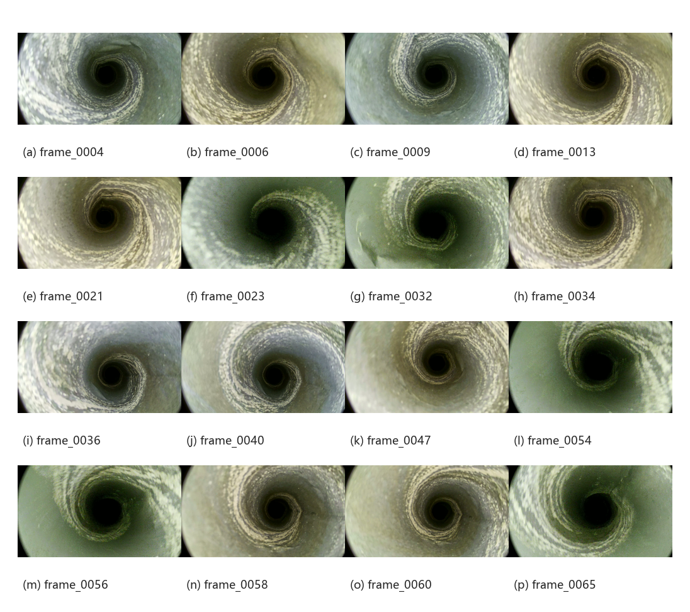

图 5-1 管道模拟钻孔图像数据集样例。


## 2.对比实验设置

本文对比四种方法。方法一为霍夫圆变换，方法二为轮廓最小外接圆，方法三为基于Canny的单尺度霍夫检测，方法四为YOLOv8实例分割圆心检测。四种方法使用同一批测试图像，输出圆心和半径，并统计成功率、耗时、中心误差、半径误差和区域 IoU 等指标。
训练配置方面，YOLOv8n-seg模型以yolov8n-seg.pt为预训练权重，训练轮数为200，输入尺寸为640，batch为8，优化器为AdamW，初始学习率为0.001，学习率衰减因子为0.01，早停耐心值为50。前文已说明AdamW和YOLO系列模型的相关背景，这里只记录本文实际采用的训练参数。训练过程中开启Mosaic、MixUp、HSV扰动、随机旋转和翻转增强，并开启AMP自动混合精度训练
硬件环境为12th Gen Intel(R) Core(TM) i7-12700H，NVIDIA GeForce RTX 3060 Laptop GPU，显存6GB，Windows 11专业版，内存16GB。批量评测结果来自项目目录runs/eval/batch_eval_summary.csv，训练最终结果来自runs/segment/Borehole_Training/Y-
OLOv8n_Seg_Run1/results.csv。

## 3.量化指标

成功率表示算法在测试集中返回有效圆心和半径的比例。成功率只能说明算法是否给出结果，不能说明结果是否正确，因此需要结合误差和IoU一起分析。
平均耗时表示单张图像处理时间。方法二耗时最低，说明传统轮廓方法计算非常轻量；方法一耗时最高，说明当前图像尺寸和霍夫搜索范围下计算开销较大；方法四首次推理可能包含模型加载开销，因此单张耗时会受运行状态影响。
中心误差表示预测圆心与标注圆心之间的欧氏距离，单位为像素。该指标直接对应本文任务目标，是评价圆心检测质量的重要指标。
半径误差表示预测半径与标注半径的绝对差，单位为像素。本文核心关注圆心，但半径会影响圆周绘制和IoU，因此也需要统计。
预测圆与标注掩码IoU用于跨方法比较。它把每种方法输出的圆转换为区域，再与标注Mask比较。该指标能反映预测圆是否覆盖了目标区域。对于方法四，内部Mask IoU还可以描述预测圆与模型输出Mask的一致性。
边缘覆盖率和霍夫置信度更适合分析传统边缘类方法。对于方法四，若模型输出的是较平滑的语义区域，原始边缘覆盖率可能并不能完整反映其质量。因此论文中不把边缘覆盖率作为方法四的主要指标，而以中心误差和区域IoU为主。

## 4.结果与可视化

YOLOv8n-seg模型第200轮训练结果如下：Box Precision为0.99817，Box Recall为1.00000，Box mAP50为0.99500，Box mAP50-95为0.90920；Mask Precision为0.99817，Mask Recall为1.00000，Mask mAP50为0.99500，Mask mAP50-95为0.87585。该结果说明模型在当前验证集上能够较稳定地识别和分割hole类目标。但由于验证集来自同一数据来源，仍需避免把该结果外推到真实场地。
表 5.1 16 张测试集上的四方法批量评测结果
Tab 5.1 Batch evaluation results of the four methods on the 16-image test set
方法	样本数	成功率(%)	平均耗时(ms)	中心误差(px)	半径误差(px)	预测圆-标注掩码IoU
霍夫圆变换	16	100.00	31456.68	263.02	141.37	0.1190
轮廓最小外接圆	16	100.00	8.18	687.92	82.44	0.0000
Canny+霍夫	16	6.25	26.30	277.25	55.17	0.0000
YOLOv8分割	16	100.00	145.67	5.14	8.25	0.9057
如表 5.1中可以看到，方法一和方法二都返回了100%的成功率，但它们的中心误差较大。这说明成功返回圆参数并不代表检测到了正确的钻孔目标。方法二平均耗时很低，但预测圆与标注掩码IoU为0，说明它常常拟合到了错误区域。方法三成功率只有6.25%，说明在当前参数和测试图像下，Canny边缘图难以稳定支撑霍夫圆检测。

图 5-2 为多方法对比效果图。


方法四在测试集上平均中心误差约5.14像素，半径误差约8.25像素，预测圆与标注掩码IoU约0.9057，明显优于前三种方法。这个结果与方法四的设计逻辑一致：模型先定位目标区域，再由Mask后处理估计圆心，比单纯依赖边缘和阈值更适合当前模拟图像。

图 5.2为多方法对比效果图。前端开始“对比模式”，运行同一张测试图，可以导出四宫格结果图

为了更清楚地说明模型训练过程，本文没有直接使用YOLO默认生成的综合results.png，而是从results.csv中重新绘制了分组训练曲线。图 5.3为训练损失变化曲线，包含box_loss、seg_loss、cls_loss和dfl_loss。训练前期损失下降较快，后期变化趋于平缓，说明模型在当前数据上逐渐完成拟合。需要注意的是，损失下降只能说明训练过程收敛，不能单独证明圆心检测结果一定准确，因此还需要结合后续批量评测结果分析。

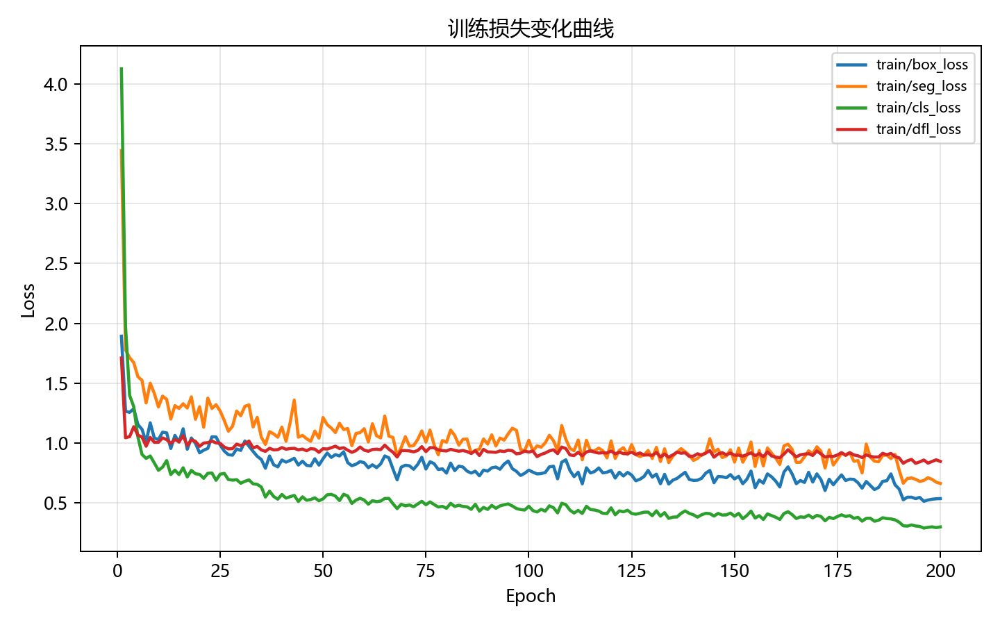

图 5-3(a) 训练损失变化曲线。

图 5.4为验证损失变化曲线。验证损失用于观察模型在验证集上的表现。如果训练损失持续下降而验证损失明显上升，通常需要警惕过拟合。当前曲线中，验证损失后期整体保持在相对稳定区间，没有出现持续大幅上升的情况，说明模型在当前验证集上的表现没有明显失控。但由于验证集仍来自同一管道模拟数据来源，这一结果不能替代真实场地验证。

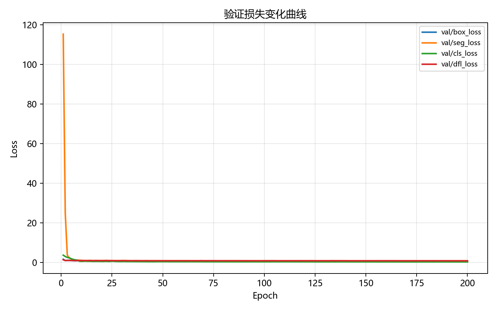

图 5-3(b) 验证损失变化曲线。

图 5.5为检测指标变化曲线，包括precision、recall、mAP50和mAP50-95。第200轮时，Box Precision为0.99817，Box Recall为1.00000，Box mAP50为0.99500，Box mAP50-95为0.90920。这些指标说明模型在当前验证集上能够较好地定位hole类目标框。由于本文最终圆心不是直接取检测框中心，因此该图主要用于说明模型目标定位能力，而不是直接作为圆心精度结论。

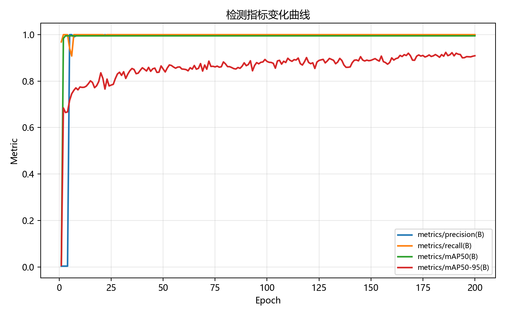

图 5-3(c) 检测指标变化曲线。

图 5.6为分割Mask相关指标变化曲线。第20轮时，Mask Precision为0.99817，MaskRecall为1.00000，Mask mAP50为0.99500，Mask mAP50-95为0.87585。Mask mAP50较高，说明在较宽松IoU阈值下，模型能够较稳定地分割目标区域；Mask mAP50-95低于mAP50，说明在更严格的IoU阈值下，掩码边界精度仍有提升空间。这个结果与本文方法四的后处理逻辑有关，因为圆心计算依赖Mask区域，如果掩码边界质量进一步提高，圆心和半径估计也可能更稳定。

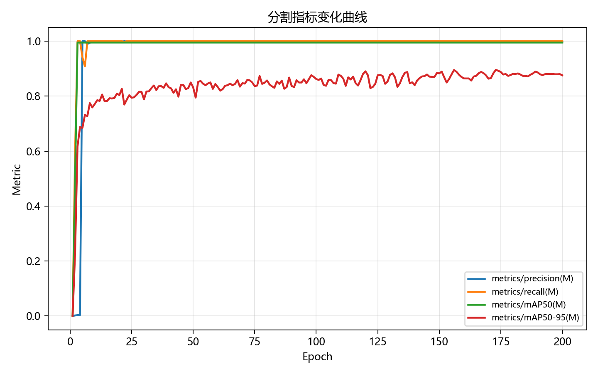

图 5-3(d) 分割指标变化曲线。


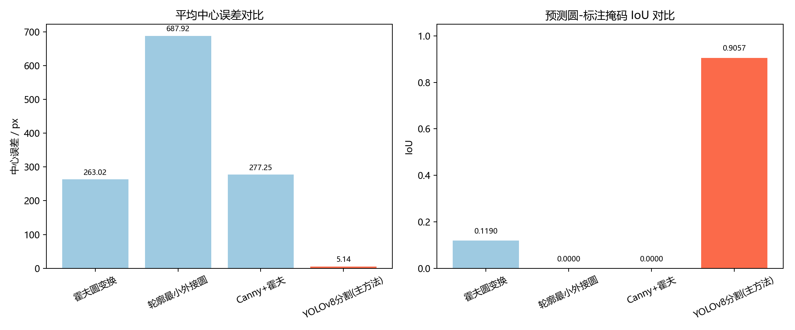

图 5-4 四方法中心误差与 IoU 对比图。

图 5.7给出了四种方法中心误差和预测圆-标注掩码IoU的柱状对比。左图中，YOLOv8分割方法的平均中心误差为5.14 px，低于三个传统对比方法；右图中，YOLOv8分割方法的IoU为0.9057，高于其余方法。该图和表 5.1相互对应，能够更直观地说明：在当前16张管道模拟测试图像上，方法四的圆心位置和区域重合效果更接近标注结果。
由此可以看出方法一的成功率偏高，但耗时较高，平均中心误差也较大，说明它在当前参数下经常能检测出圆，却容易受到错误边缘和半径搜索范围影响。方法二耗时最短，但预测圆与标注掩码IoU为0，说明它很可能选择了错误连通区域；这与二值化对光照和背景敏感的特点一致。方法三成功率最低，说明外部Canny边缘图并没有稳定提供足够的圆周支持。相比之下，方法四先获得目标Mask，再由图像矩或最小外接圆得到圆心，减少了对完整圆周边缘的依赖，因此在当前模拟测试集上表现更接近标注结果。
不过，这一结论仍然需要限定范围。当前测试集只有16张，且数据来源为管道模拟图像，不能据此断言方法四在所有钻孔图像中都优于传统方法。更严谨的表述应当是：在当前实现、当前参数配置和当前模拟测试集下，YOLOv8分割圆心检测方法取得了更小的中心误差和更高的区域IoU。后续若加入真实野外图像，传统方法参数重新优化后，结果仍需要重新评测。


## 5.实验结论

当前实验表明，在自采集标注的管道模拟数据上，基于YOLOv8实例分割的圆心检测方法明显优于三个传统对比方法。方法四能够利用Mask的区域信息估计圆心，使平均中心误差降低到约5.14像素，并取得约0.9057的预测圆-标注掩码IoU。
传统方法的问题并不完全相同。霍夫圆变换能够经常给出候选圆，但在参数范围较大、背景边缘复杂时容易偏移，耗时也高。轮廓最小外接圆速度快，但高度依赖二值化结果，容易拟合到错误连通块。基于Canny的霍夫单尺度检测虽然增加了边缘层控制和形态学连接，但当图像边缘本身质量不足时，仍难以稳定检测。
方法四的优势来自两个方面：一是神经网络分割提供了目标区域级表达，不只依赖单圈边缘；二是后处理阶段通过图像矩或最小外接圆把Mask转换成圆心和半径，保留了明确的几何输出。这个组合比较适合本文的钻孔图像圆心检测任务。
与此同时，实验也有明显局限。测试集只有16张，规模偏小；数据来自管道模拟场景，没有真实野外场地数据；前三种传统方法未做大规模参数网格搜索，结果反映的是当前系统默认配置下的表现。后续要进一步增强结论，需要补充真实数据、扩大测试集，并对传统方法进行更公平的参数优化实验。

# 第 6 章 总结与展望（1600 字）

## 1.工作总结

本文围绕“基于神经网络的钻孔图像圆心鲁棒检测方法”完成了算法设计、系统实现和初步实验分析。项目不是单独实现一个模型推理脚本，而是构建了一套包含传统方法、神经网络方法、前端交互、后端接口和评价指标的完整实验框架。
算法方面，本文实现了四种检测方法。方法一采用霍夫圆变换，方法二采用二值化轮廓与最小外接圆，方法三采用Canny边缘、形态学闭运算和霍夫圆，方法四采用 YOLOv8实例分割与几何后处理。前三种方法为对比基线，方法四为核心方法。方法四通过Mask表达目标区域，再使用图像矩或最小外接圆估计圆心和半径，形成了“神经网络感知+几何拟合”的圆心检测流程。
系统方面，本文完成了基于FastAPI的后端接口和基于HTML、JavaScript和Tailwind CSS的前端界面。系统支持图像上传、参数调节、单方法检测、四方法对比、结果图展示和PNG导出。四种算法返回统一结构，方便前端渲染和批量评测。
实验方面，本文使用自采集标注的管道模拟数据集完成YOLOv8n-seg训练和测试集评测。当前数据划分为训练集112张、验证集32张、测试集16张。在第200轮训练时，模型在验证集上取得Box mAP50 0.995和Mask mAP50 0.995。在测试集批量评测中，YOLOv8分割方法平均中心误差约5.14像素，预测圆与标注掩码IoU约0.9057，明显优于当前配置下的三个传统方法。

## 2.不足与局限

本文最主要的不足是数据来源仍然单一。当前数据为管道模拟采集并标注，还没有真实场地钻孔图像。真实环境可能存在泥浆遮挡、岩屑、孔壁裂隙、探头抖动、水雾、强反光和极低照度等问题。模型在模拟数据上的表现不能直接代表真实场景表现。
第二个不足是测试集规模偏小。16张测试图像能够提供初步趋势，但不足以支撑非常强的统计结论。后续应扩大测试集规模，并按场景类型划分样本，例如清晰样本、遮挡样本、模糊样本、偏心样本和边缘破损样本，分别统计指标。
第三个不足是传统方法参数优化不够充分。当前结果来自系统默认或已有配置，前三种方法没有进行系统网格搜索或自适应参数优化。因此如果能对每个测试数据都能找到最好的参数，再说明“在当前实现和参数配置下，方法四表现更好”，能更有效的看出方法四的优势。

## 3.未来展望

后续工作首先应补充真实场地数据。可以在实验室模拟更复杂工况，也可以与实际工程场景结合采集钻孔图像。新增数据需要建立统一标注规范，尤其要明确圆心、半径和Mask的标注规则，减少标签噪声。
第二，可以扩展视频处理能力。当前系统处理单张图像，如果输入来自钻孔视频，则可以利用相邻帧之间的时序关系平滑圆心结果。视频场景下，单帧偶然误检可以通过时间连续性进行修正，这对实际使用会更有帮助。
第三，进一步加强鲁棒性实验。后续可人为加入噪声、遮挡、模糊和亮度变化，构建受控退化实验，观察四种方法在不同退化程度下的性能变化。
第四，可以优化系统工程结构。模型路径、训练配置、评测配置可以统一放入配置文件；批量评测脚本可以加入更多输出图表；前端可以增加失败样本导出功能，方便后续分析模型薄弱点。
第五，可以尝试更轻量或更强的分割模型。当前使用YOLOv8n-seg，优点是轻量、训练和推理成本较低。若未来硬件条件允许，可以比较YOLOv8s-seg、YOLOv11系列或其他实例分割模型。但模型升级应以真实场景效果和推理成本为依据，而不是单纯追求更大的模型。

# 参考文献
[1]朱云,凌志刚,张雨强.机器视觉技术研究进展及展望[J].图学学报,2020,41(06):871-890.
[2]宋帅帅,黄锋,江燕斌.基于机器视觉几何量测量技术研究进展分析[J].电子测量技术,2021,44(03):22-26.DOI:10.19651/j.cnki.emt.2005587.
[3]刘迪,张泽家,卢才武,等.基于YOLOv11s融合结构相似性的深井钻孔内壁环状全景自适应拼接方法[J].煤炭学报,2026,51(02):1747-1759.DOI:10.13225/j.cnki.jccs.2025.0541.
[4]CANNY J. A computational approach to edge detection[J]. IEEE Transactions on Pattern Analysis and Machine Intelligence, 1986, 8(6): 679-698. DOI: 10.1109/TPAMI.1986.4767851.
[5]DUDA R O, HART P E. Use of the Hough transformation to detect lines and curves in pictures[J]. Communications of the ACM, 1972, 15(1): 11-15. DOI: 10.1145/361237.361242.
[6]MARR D, HILDRETH E. Theory of edge detection[J]. Proceedings of the Royal Society of London Series B: Biological Sciences, 1980, 207(1167): 187-217. DOI: 10.1098/rspb.1980.0020.
[7]BALLARD D H. Generalizing the Hough transform to detect arbitrary shapes[J]. Pattern Recognition, 1981, 13(2): 111-122. DOI: 10.1016/0031-3203(81)90009-1.
[8]YUEN H K, PRINCEN J, ILLINGWORTH J, et al. Comparative study of Hough transform methods for circle finding[J]. Image and Vision Computing, 1990, 8(1): 71-77. DOI: 10.1016/0262-8856(90)90059-E.
[9]LINDEBERG T. Edge detection and ridge detection with automatic scale selection[J]. International Journal of Computer Vision, 1998, 30(2): 117-154. DOI: 10.1023/A:1008097225773.
[10]LOWE D G. Distinctive image features from scale-invariant keypoints[J]. International Journal of Computer Vision, 2004, 60(2): 91-110. DOI: 10.1023/B:VISI.0000029664.99615.94.
[11]JING J, LIU S, WANG G, et al. Recent advances on image edge detection: a comprehensive review[J]. Neurocomputing, 2022, 503: 259-271. DOI: 10.1016/j.neucom.2022.06.083.
[12]Xianen Z ,Yaonan W ,Qing Z , et al.Circle detection with model fitting in polar coordinates for glass bottle mouth localization[J].The International Journal of Advanced Manufacturing Technology,2022,120(1-2):1041-1051.DOI:10.1007/S00170-022-08785-1.
[13]HE K, Gkioxari G, DOLLÁR P, et al. Mask R-CNN[C]//Proceedings of the IEEE International Conference on Computer Vision. Piscataway: IEEE, 2017: 2980-2988.
[14]RONNEBERGER O, FISCHER P, BROX T. U-Net: Convolutional networks for biomedical image segmentation[C]//MICCAI. 2015: 234-241. arXiv:1505.04597.
[15]LOSHCHILOV I, HUTTER F. Decoupled weight decay regularization[C]//International Conference on Learning Representations. 2019.
[16]TERVEN J, CORDOVA-ESPARZA D M, ROMERO-GONZALEZ J A. A comprehensive review of YOLO architectures in computer vision: From YOLOv1 to YOLOv8 and YOLO-NAS[J]. Machine Learning and Knowledge Extraction, 2023, 5(4): 1680-1716. DOI: 10.3390/make5040083.
[17]LU M, DONG J, CHEN X, et al. A novel four-step algorithm for detecting a single circle in complex images[J]. Sensors, 2023, 23(22): 9059. DOI: 10.3390/s23229059.
[18]REDMON J, DIVVALA S, GIRSHICK R, et al. You only look once: Unified, real-time object detection[C]//CVPR. 2016: 779-788.
[19]HAN J Y, ZHANG X M, QI Y J, LIU L. Intelligent identification of fractures and holes in ultrasonic logging images based on the improved YOLOv8 model[J]. Artificial Intelligence in Geosciences, 2025, 6(2): 100167. DOI: 10.1016/j.aiig.2025.100167.
[20]MA X B, QU F M, HE W X, WANG L C, LIU X B. Intelligent detection method for internal fractures in mine rock masses based on borehole camera images[J]. Journal of Rock Mechanics and Geotechnical Engineering, 2025, 17(8): 4802-4814. DOI: 10.1016/j.jrmge.2024.10.027.
[21]YU Q J, WANG G N, CHENG H, GUO W Z, LIU Y B. The segmentation and intelligent recognition of structural surfaces in borehole images based on the U2-Net network[J]. PLOS ONE, 2024, 19(3): e0299471. DOI: 10.1371/journal.pone.0299471.
[22]LI C, ZOU C C, PENG C, LAN X X, ZHANG Y Y. Intelligent identification and segmentation of fractures in images of ultrasonic image logging based on transfer learning[J]. Fuel, 2024: 131694. DOI: 10.1016/j.fuel.2024.131694.
[23]苏丽,孙雨鑫,苑守正.基于深度学习的实例分割研究综述[J].智能系统学报,2022,17(01):16-31.
[24]景晓军,李剑峰,熊玉庆.静止图像的一种自适应平滑滤波算法[J].通信学报,2002,(10):6-14.
[25]徐武,张强,王欣达,等.基于改进Canny算子的图像边缘检测方法[J].激光杂志,2022, 43(4):103-108.
[26]李靖,王慧,闫科,等.改进Canny算法的图像边缘增强方法[J].测绘科学技术学报,2021,38(4):398-403.
[27]唐路路,张启灿,胡松.一种自适应阈值的Canny边缘检测算法[J].光电工程,2011,38(5)101-107.
[28]雷良育,周晓军潘明清.基于机器视觉的轴承内外径尺寸检测系统[J].农业机械学报,2005(3):131-134.
[29]蔡永洪.基于机器视觉的玻璃量器液面调定不确定度研究[J]中国测试,2022,48(S1):73-78.
[30]孙丰荣,刘积仁.快速霍夫变换算法[J].计算机学报,2001(10):1102-1109.
[31]张红民,何健鹰.用改进的广义Hough变换获取靶纸图像子像素级圆心坐标[J].计算机与现代化,2003,(10):43-45+50.
[32]樊慧超.机器视觉技术在工业检测中的应用[J].数字通信世界,2020(12):2.
[33]段红燕,邵豪,张淑珍,等.一种基于Canny算子的图像边缘检测改进算法[J].上海交通大学学报,2016,50(12):1861-1865.DOI:10.16183/j.cnki.jsjtu.2016.12.009.
[34]许宏科,秦严严,陈会茹.一种基于改进Canny的边缘检测算法[J].红外技术,2014, 36(3):210-214.
[35]BRADSKI G. The OpenCV Library[J]. Dr. Dobb's Journal of Software Tools, 2000, 25(11): 120-123.
[36]OTSU N. A threshold selection method from gray-level histograms[J]. IEEE Transactions on Systems, Man, and Cybernetics, 1979, 9(1): 62-66. DOI: 10.1109/TSMC.1979.4310076.
[37]SUZUKI S, ABE K. Topological structural analysis of digitized binary images by border following[J]. Computer Vision, Graphics, and Image Processing, 1985, 30(1): 32-46. DOI: 10.1016/0734-189X(85)90016-7.
[38]HU M K. Visual pattern recognition by moment invariants[J]. IRE Transactions on Information Theory, 1962, 8(2): 179-187. DOI: 10.1109/TIT.1962.1057692.

# 致谢
此刻论文已毕，光标在屏幕上安静闪烁，像一座建成的灯塔。这是一个结束，标志着我大学四年的时光马上就要流尽了，也是我在进入陌生环境中，为自己点亮的第一座灯塔。在AI重塑一切规则的时代完成学业，有些不知所措，前路难免有些迷茫，像在洪水来临前拿到了最后一张旧地图。
首先衷心感谢我的导师宋老师。在毕设进行中，总是和我一起商量课题的方向进展，从工程到算法，您从不直接给我答案，而是用一些建议或想法来引导我自己思考联想，来跳出错误的递归。这种训练，远比解决一个具体问题重要。您教会我的，是调试人生的方法。
感谢我的室友们和班上、同专业经常来我们寝室玩的“室友们”。四年时光，大一的时候还要一起在深夜为第二天的考试焦头烂额，也多次一起在烧烤摊谈论着遥不可及的未来。计算机中非0即1，但你们让我的大学生活充满了温暖的灰度。那些共同拥有的、未经压缩的时光，是我自己脑子里最珍贵的常驻数据。
感谢我的朋友们。感谢游戏里的队友，你们用即时的快乐，为我提供了对抗现实压力的高并发处理。感谢实习中认识的伙伴，你们分享的工作实况，是我预览未来世界的珍贵镜像。尤其感谢我的那几个高中好兄弟们，每次回长沙，都会跟你们到处吃喝玩乐：网吧、各种自助餐，你们还陪我一起去别的城市面试，顺便作为旅行，我们玩的这么多地方，重要的从来不是目的地，而是同行的人。
感谢我的家人。我的世界在扩展，而你们的坐标始终为我恒定。你们从不深问我学了哪些复杂的技术，只是关心我睡得好不好，吃的好不好，身上还有没有钱，这周回不回家。你们是我一切运行的底层，是我所有勇气最初始的commit。这份爱，静默如内核，却支撑着所有应用层的绚烂。
AI发展如此之快，我好像站在新旧世界模糊的交界线上，我拥有的是一门快速自我迭代的手艺，和一颗尚未被算法完全解析的、属于人的心灵。前路是巨大的未知函数，我可能也只是一段即将被投喂到现实模型里的微调数据。
但毕竟，我已被你们如此丰富地训练过。
感谢所有参与我生活的每一个人，好像我的人生也才刚刚开始...既然有旧地图，那我也可以去尝试发现新大陆。